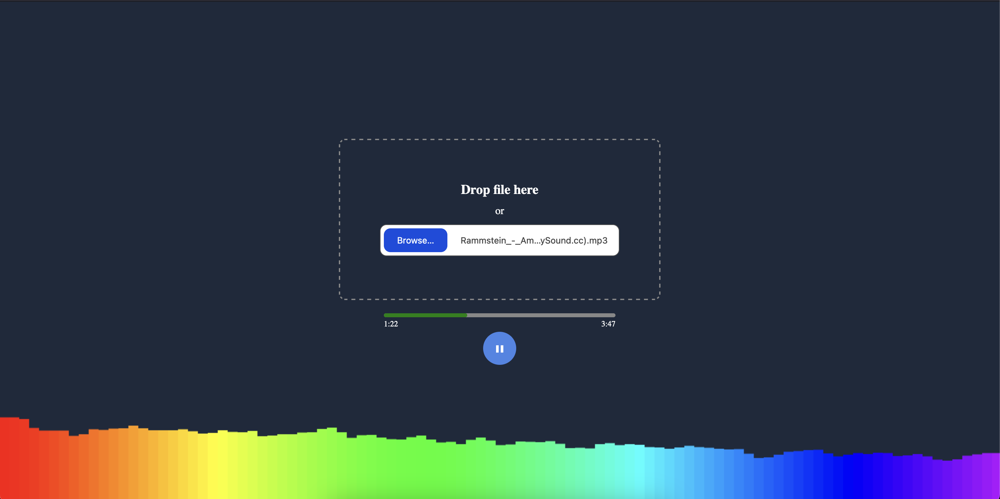

<p align="center">
    <p align="center">
        
    </p>
    <h1 align="center"><b>Melodizer</b></h1>
	<p align="center">
        Check it out - 
        <a href="https://aansmirnov.github.io/melodizer/">click</a>.
    </p>
</p>

<br />

<p align="center">Simple music visualizer.</p>



### Getting Started

- Clone a repository

```bash
git clone https://github.com/aansmirnov/melodizer.git
```

- Install dependencies

```bash
pnpm install
```

- Start a project

```bash
pnpm dev
```

### Tech Stack

```
- Vite
- TypeScript
```
